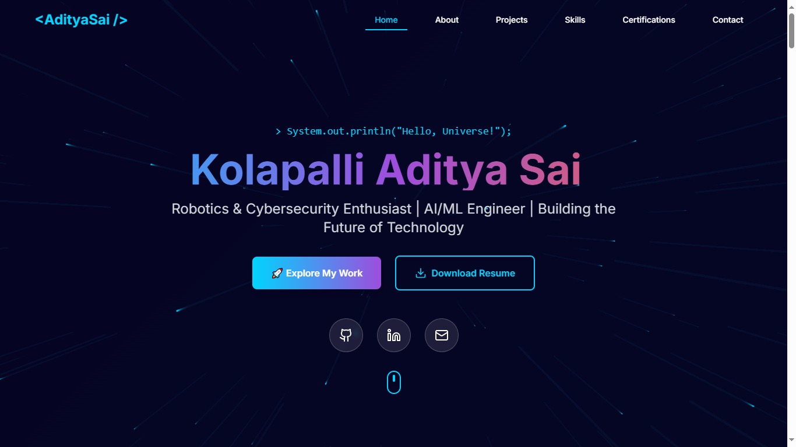

# Personal Portfolio (Next.js)

This repository contains a single-page personal portfolio application built with Next.js App Router, React, TypeScript, Tailwind CSS, and Framer Motion.

Live Demo: [aditya-sai-19-portfolio.vercel.app](https://aditya-sai-19-portfolio.vercel.app/)



## Who This README Is For

This README is written for new developers joining the project. It covers:

- What the app does
- How the codebase is organized
- How data and UI flow work
- How to run, customize, and deploy safely

For deeper references, also read:

- `API_DEVELOPER_DOCS.md`
- `ARCHITECTURE_OVERVIEW.md`

## Current Product Scope

This is currently a **frontend-only portfolio site** with no backend services.

Implemented functionality:

- Full-page loader animation before content render
- Animated starfield background canvas
- Sticky header with section-based smooth scrolling
- Hero section with typewriter-style name reveal and social links
- About section with journey, vision, education, and work experience cards
- Community section with leadership roles and organization cards
- Projects section with project metadata, feature bullets, and external links
- Skills section with animated progress bars, soft skills, and tools list
- Certifications section with category badges and outbound certificate links
- Contact section with a form that opens the user’s email client via `mailto`

Not currently implemented:

- REST/GraphQL API endpoints
- Database persistence
- Server-side form handling
- Authentication/authorization

## Tech Stack

- Framework: `next` `^15.5.9` (App Router)
- UI: `react` `^18.3.1`, `framer-motion`, `lucide-react`
- Styling: `tailwindcss` + custom theme tokens
- Language: TypeScript (`strict: true`)
- Utilities: `clsx`, `tailwind-merge`
- Deployment target: Vercel/static-friendly hosting

## Project Structure (Actual)

```txt
Portfolio/
+-- app/
|   +-- globals.css               # Global CSS variables + Tailwind layers
|   +-- layout.tsx                # Root HTML shell + metadata + font
|   +-- page.tsx                  # Main single-page composition
+-- components/
|   +-- Header.tsx                # Top navigation and smooth-scroll logic
|   +-- Hero.tsx                  # Intro, CTA, social links, resume download
|   +-- About.tsx                 # About narrative + highlights + education/experience
|   +-- Community.tsx             # Community leadership roles and organization highlights
|   +-- Projects.tsx              # Project cards and external links
|   +-- Skills.tsx                # Technical skills, soft skills, tools
|   +-- Certifications.tsx        # Certification cards and stats
|   +-- Contact.tsx               # Contact UI + mailto form flow
|   +-- StarField.tsx             # Canvas-based animated background
|   +-- Loader.tsx                # Intro loading animation
|   +-- ui/                       # Shadcn/Radix-style reusable primitives
+-- constants/
|   +-- theme.ts                  # Theme constants + social links
+-- hooks/
|   +-- use-toast.ts              # Toast state manager (currently not wired to page)
+-- lib/
|   +-- utils.ts                  # `cn()` className merge helper
+-- public/
|   +-- favicon.png
|   +-- resume.pdf
+-- next.config.js
+-- tailwind.config.ts
+-- tsconfig.json
+-- README.md
```

## End-to-End Runtime Flow

1. `app/layout.tsx` sets up global HTML, font, and metadata.
2. `app/page.tsx` renders `<Loader />` first for `THEME.animation.loadingDelay` (2s).
3. After loading, it renders the main page tree in this order:
   - `StarField`
   - `Header`
   - `Hero`
   - `About`
   - `Community`
   - `Projects`
   - `Skills`
   - `Certifications`
   - `Contact`
4. Navigation in `Header` scrolls to section IDs via `element.scrollIntoView({ behavior: 'smooth' })`.
5. Contact form in `Contact` encodes form values and opens default mail client with a generated `mailto:` URL.

## Configuration Notes

- `constants/theme.ts` centralizes animation timing and social links used across components.
- `tailwind.config.ts` defines custom colors (`electric-cyan`, `space-blue`, etc.) and keyframe animations.
- `next.config.js` currently sets:
  - `eslint.ignoreDuringBuilds: true`
  - `typescript.ignoreBuildErrors: true`
  - `images.unoptimized: true`

These settings are convenient for rapid iteration but reduce production build strictness.

## Setup and Run

1. Install dependencies:

   ```bash
   npm install
   ```

2. Start dev server:

   ```bash
   npm run dev
   ```

3. Open:

   ```txt
   http://localhost:3000
   ```

4. Production build:

   ```bash
   npm run build
   npm run start
   ```

## Environment Variables

Current `.env.local` contains:

```env
NODE_ENV=development
```

No API keys or external service secrets are required in the current implementation.

## Developer Scripts

- `npm run dev` — run local development server
- `npm run build` — create production build
- `npm run start` — run production server
- `npm run lint` — run Next.js linting

## Onboarding Guidance for Freshers

Recommended first reading order:

1. `app/page.tsx` (top-level composition)
2. `constants/theme.ts` (global constants)
3. All section components in `components/`
4. `tailwind.config.ts` + `app/globals.css`
5. `ARCHITECTURE_OVERVIEW.md`
6. `API_DEVELOPER_DOCS.md`

Recommended first tasks:

- Add one new section component and wire it in `app/page.tsx`
- Add one new project card in `components/Projects.tsx`
- Add one new certification entry in `components/Certifications.tsx`
- Replace `mailto` contact flow with a real API endpoint (see API docs)

## Deployment

Typical Vercel flow:

1. Push repository to GitHub.
2. Import repository in Vercel.
3. Build command: `npm run build`
4. Start command: `npm run start` (if needed by host)

Because this app is mostly static-client rendered content, it can also be hosted on other Node-compatible platforms.

## License

This project is licensed under the [MIT License](LICENSE.md).
